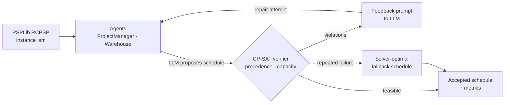

# ICDAM 2025 — Benchmark-centric Hybrid LLM Multi-Agent System for SCM

<p>
  
  
  
  
  
</p>

Research codebase for a **hybrid multi-agent system** that combines **LLM-driven negotiation** with **symbolic optimization** (Google OR-Tools / CP-SAT) on **PSPLib-style** project scheduling benchmarks. Target direction: a paper-oriented contribution around **benchmark-grounded MAS** + **solver verification** (OptiMUS-style self-correction loop).

---

## Problem statement

Supply-chain and project scheduling contexts require both:

- **Flexible reasoning** (negotiation, explanations, policy-like decisions), and
- **Hard feasibility** (resource capacities, precedence, makespan objectives).

This project prototypes agents (e.g. warehouse vs. project manager) that propose allocations via an LLM, while grounding outcomes in **solver-checked** schedules.

## How it works



1. **Benchmark-first:** load real RCPSP instances (PSPLib `j30`), not toy graphs.
2. **LLM brain with resilience:** if Gemini is unavailable (429/network), fall back to **mock mode** so experiments stay reproducible.
3. **Verification loop:** every LLM-proposed schedule is checked by OR-Tools CP-SAT; violations are fed back for repair, and a provably-optimal solver schedule is the safety net.
4. **Metrics:** `SimulationMetrics` tracks makespan / feasibility / gap for cross-run comparison.

---

## Repository structure

| Path | Purpose |
|------|---------|
| `main_simulation.py` | End-to-end entry: load benchmark → instantiate agents → negotiation → solver checks. **Accepts an instance path as `argv[1]`** |
| `run_benchmark_solver.py` | Batch solver sweep over instances → aggregated metrics |
| `agents/` | Role-based agents + `llm_brain.py` (LLM client + mock fallback) |
| `solvers/` | RCPSP parser + CP-SAT wrapper (`RCPSPParser`, `RCPSPSolver`) |
| `utils/` | PSPLib parsing, schedule parsing/formatting, metrics |
| `scenarios/` | Scenario configs / fixtures |
| `data/` | Benchmark instances (PSPLib `.sm`) |
| `results/` | Run outputs / exports |

---

## Setup

```bash
python -m venv .venv
source .venv/bin/activate        # macOS / Linux
# .venv\Scripts\activate         # Windows
pip install -r requirements.txt
```

Create a `.env` in the repo root (never commit it):

```env
GOOGLE_API_KEY=your_key_here
LLM_MODEL_NAME=gemini-1.5-flash
```

Sanity checks:

```bash
python check_setup.py     # verifies env + deps
python check_models.py    # lists reachable LLM models
```

---

## Run

```bash
# Single simulation on a specific instance
python main_simulation.py data/raw/rcpsp/j30/j301_1.sm

# Or run with the default instance
python main_simulation.py

# Solver-only benchmark sweep
python run_benchmark_solver.py
```

> Run from the **repository root** — data paths are resolved relative to it.

### Sample output

```
[Instance j301_1]  makespan=43  feasible=True  solver_optimal=38  gap=13.2%
[LLM attempt 1] infeasible → 2 precedence violations → repairing…
[LLM attempt 2] feasible ✓
Aggregated over 5 instances → mean gap: 9.8% | feasible: 5/5
```

*(illustrative — see `results/` for real run exports)*

---

## Status & honesty box

- Coverage (negotiation + solver verification) is **research-grade**, not production middleware.
- For an ICDAM-style submission: tighten **evaluation tables, baselines, and ablations**; pin **random seeds** and record hardware/API versions for reproducibility.

## References (in-code)

Influences cited in docstrings of `main_simulation.py`: **AgentScope**, **REALM-Bench**, **OptiMUS**.

## Acknowledgements

Thanks to a software engineer at **Google** who reviewed this project and gave encouraging
feedback on the **LLM-as-proposer / solver-as-verifier** approach. *(Reviewer name/handle can be
added here with their permission.)*

---

## Maintainer

[@zenith-nguyen](https://github.com/zenith-nguyen)

## License

Released under the MIT License — see [`LICENSE`](LICENSE).
